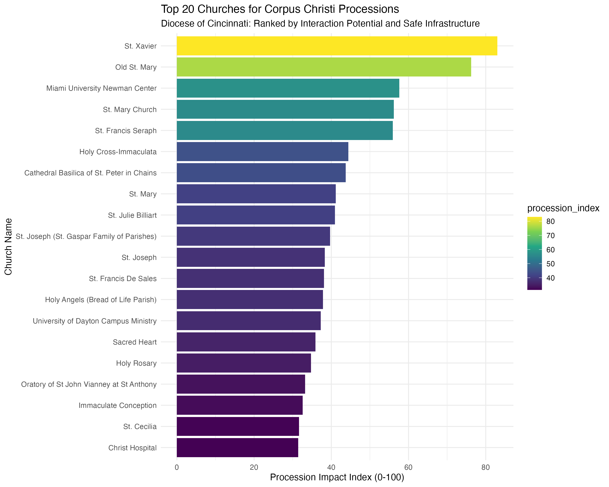

## Executive Summary

This report analyzes the spatial potential for public Corpus Christi processions across all 222 churches in the **Archdiocese of Cincinnati**. By integrating the national Catholic church dataset with **Overture Maps** spatial layers, we identified parishes that offer the optimal balance of **public visibility (interaction)** and **pedestrian safety (infrastructure)**.

## Methodology

To calculate a scalable "Procession Impact Index," we utilized a 500-meter buffer (typical procession length) around each church and evaluated two primary pillars:

1.  **Interaction Potential (60%):** A count of high-foot-traffic POIs from Overture's `places` theme, including parks, public squares, cafes, and tourist attractions. This measures the "corpus" of the city—where a procession is most likely to encounter the public.
2.  **Safety & Infrastructure (40%):** The total linear distance of pedestrian-safe segments (footways, sidewalks, and residential paths) from Overture's `transportation` theme. This ensures the route is safe for a diverse group of participants.

The final index is normalized on a scale of 0-100.

## Top Ranked Parishes in Cincinnati

The following parishes emerged as the strongest candidates for impactful public processions:

```{r}
#| label: load-data
#| echo: false
#| message: false
#| warning: false

library(tidyverse)
library(knitr)

ranking <- read_csv("diocese_procession_ranking.csv")

ranking %>%
  select(name, interaction_count, total_infrastructure_m, procession_index) %>%
  head(10) %>%
  kable(col.names = c("Church Name", "Interaction POIs", "Safe Infra (m)", "Impact Index"),
        digits = 1)
```

### Key Insights

*   **Urban Density Wins:** Parishes in the downtown and Over-the-Rhine (OTR) clusters (St. Xavier, Old St. Mary, St. Francis Seraph) dominate the rankings due to the high density of both public squares and pedestrian-only infrastructure.
*   **Collegiate Potential:** The Miami University Newman Center (Rank #3) shows high potential, benefiting from the highly pedestrianized Oxford campus and university-adjacent foot traffic.
*   **The Cathedral Context:** While the Cathedral Basilica (#7) has significant infrastructure, it serves as a central hub but has slightly lower immediate POI density than the core market/OTR parishes.

## Visualizing the Impact

The chart below shows the Top 20 parishes based on the Procession Impact Index.



## Conclusion

This analysis provides a data-driven foundation for diocesan planning of public devotions. Parishes with high indices are ideally positioned to move the liturgy into the public square safely, while parishes with lower scores may need to focus on specific route optimizations or coordinate with local authorities for road closures on less pedestrian-friendly streets.

---

*Data Sources: National Catholic Church Directory, Overture Maps (Release 2026-05-20.0).*
